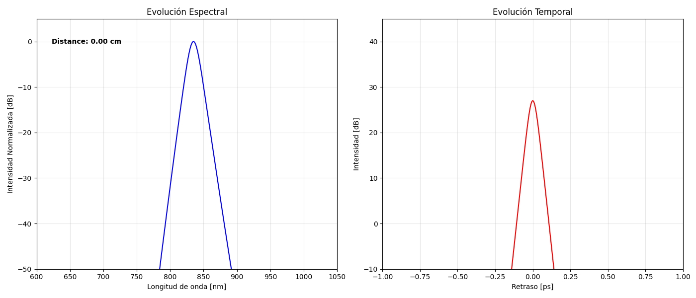

# GIFs

Aquí se muestra la variación del pulso a lo largo de la fibra para distintos parámetros.

**Deformación de un pulso de parámetros P=500 W y T0=28,4x10^-15 s:**

---

**Deformación de un pulso de parámetros P=300 W y T0=28,4x10^-15 s:**

---

**Deformación de un pulso de parámetros P=700 W y T0=28,4x10^-15 s:**

---

**Deformación de un pulso de parámetros P=500 W y T0=20x10^-15 s:**

---

**Deformación de un pulso de parámetros P=500 W y T0=50x10^-15 s:**

